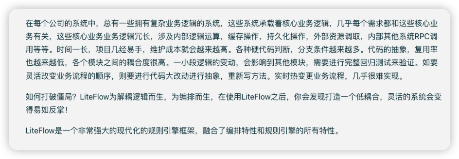

## LiteFlow简介
直接上图


总结一下就是:LiteFlow为解耦逻辑而生，为编排而生.
## 在SpringBoot中使用，引入依赖：
```xml
<dependency>
    <groupId>com.yomahub</groupId>
    <artifactId>liteflow-spring-boot-starter</artifactId>
    <version>2.12.4.1</version>
</dependency>
```
## 配置文件
```yaml
liteflow:
  #规则文件路径
  rule-source: config/flow.el.xml
```
只要使用了规则，那么rule-source必须得有，剩下的是非必需的配置。可看[**详细配置**](https://liteflow.cc/pages/4594ec/)。
然后在我们项目的resource目录下创建一个config文件夹，在config文件夹下创建一个flow.el.xml文件，内容如下：
```xml
<?xml version="1.0" encoding="UTF-8"?>
<flow>
    <chain name="chain1">
        THEN(a, b);
    </chain>
</flow>
```
## 编写业务逻辑
```java
@Component("a")
public class AComponent extends NodeComponent {
    @Override
    public void process() throws Exception {
        System.out.println("AComponent");
    }
}
```
```java
@Component("b")
public class BComponent extends NodeComponent {
    @Override
    public void process() throws Exception {
        System.out.println("BComponent");
    }
}
```
## 编写启动类
```java
@SpringBootApplication
@ComponentScan(basePackages = "com.example.liteflowdemo")
public class LiteFlowDemoApplication {
    public static void main(String[] args) {
        SpringApplication.run(LiteFlowDemoApplication.class, args);
    }
}
```
## 测试
```java
@RestController
public class TestController {
    @GetMapping("/test")
    public void test() {
        LiteFlowExecutor.execute2Resp("chain1", null);
    }
}
```
## 运行结果

上面的是最基础玩法。
还可以把一些复杂多变的业务代码放到规则文件里，更灵活。
需要引入依赖：
```xml
<dependency>
    <groupId>com.yomahub</groupId>
    <artifactId>liteflow-script-javax</artifactId>
    <version>2.12.4.1</version>
</dependency>
```
在我们的xml文件里，可以写EL表达式，比如：
```xml
 <nodes>
        <node id="someCode" type="script" language="java">
            <![CDATA[
            import com.yomahub.liteflow.script.ScriptExecuteWrap;
            import com.yomahub.liteflow.script.body.CommonScriptBody;
            import com.yomahub.liteflow.slot.DefaultContext;

            public class Demo implements CommonScriptBody {
                public Void body(ScriptExecuteWrap wrap) {
                    DefaultContext ctx = wrap.getCmp().getFirstContextBean();
                    System.out.println("hello, this is script node, memberDiscountCmp");

                    return null;
                }
            }
            ]]>
        </node>
    </nodes>
    <chain name="chain1">
        THEN(someCode);
    </chain>
```    
运行程序：

这里推荐一个插件：LiteFlowX,安装后可以直接在xml里面写代码，并且有提示。
## 最后
最后还有一种玩法，把代码放到数据库，随时改变代码逻辑，随时更替。今天有点晚了，咋们下一章聊。


